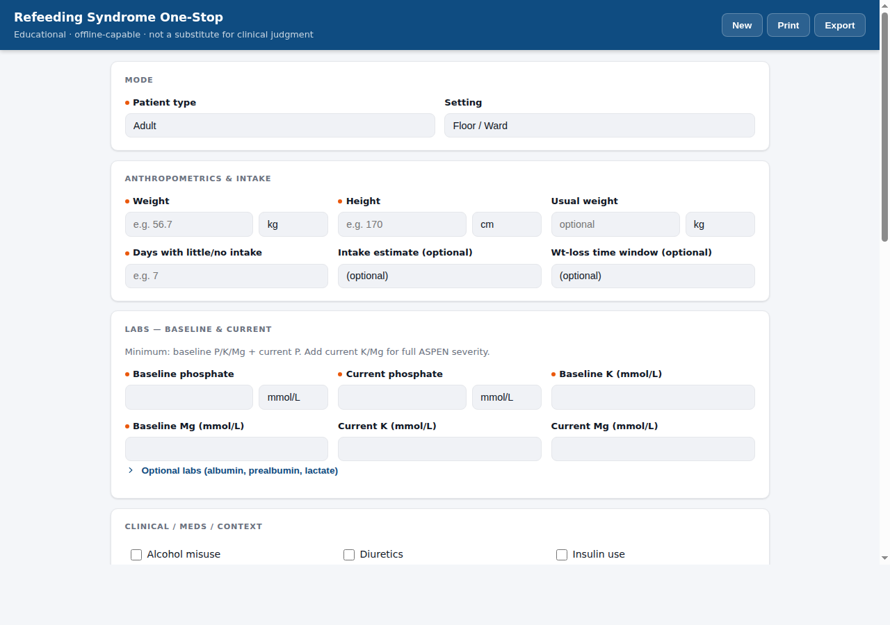
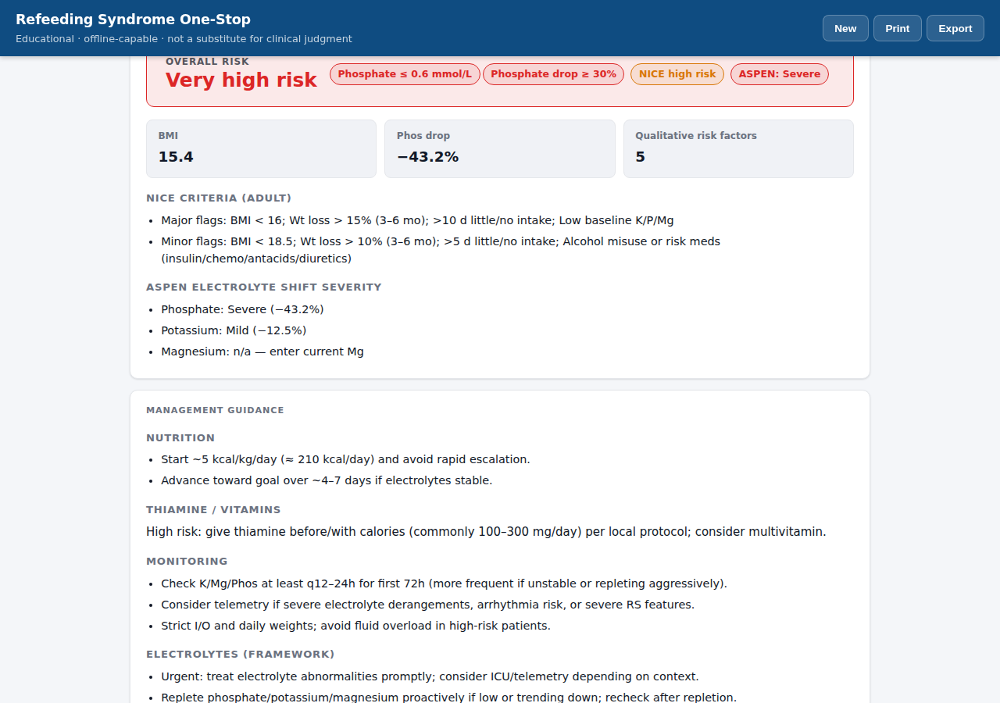
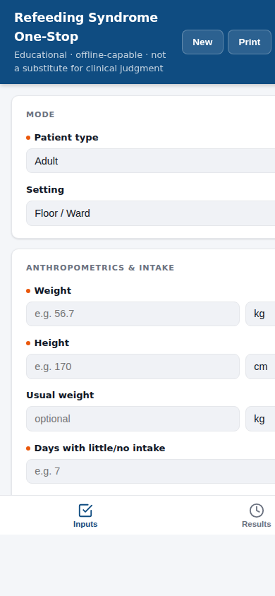

# Refeeding Syndrome One-Stop

A fast, **offline-capable** clinical decision-support tool for bedside refeeding syndrome risk assessment and management planning. Now with growth-chart Z-score calculation (WHO/CDC/China/Korea), pediatric catch-up calorie targets, and a baby food / infant formula calculator with USDA SR Legacy data. Enter anthropometrics, electrolytes, and clinical context — get an instant, colour-coded risk verdict plus a non-prescriptive care framework you can paste straight into the EMR.

> **Disclaimer** — Educational decision support only. Does not replace local protocols, pharmacy guidance, nutrition support teams, or clinician judgment. Always individualise dosing, repletion, fluid strategy, and monitoring.

---

## Screenshots

| Desktop — inputs | Desktop — results | Mobile |
|:---:|:---:|:---:|
|  |  |  |

---

## What it calculates

| Output | Source |
|---|---|
| BMI and % weight loss | Anthropometrics + usual weight |
| Electrolyte % drop (P, K, Mg) | Baseline → current values |
| **ASPEN severity** (None / Mild / Moderate / Severe) | Worst-across-electrolytes shift category |
| **NICE high-risk** (adult) | Major + minor flag count |
| **Imminent danger flags** | Phos ≤ 0.6 mmol/L and/or ≥ 30% drop |
| **Overall risk label** | Very high / High / Moderate / Lower |
| **Growth Z-scores** (pediatric) | Weight, length/height, age, sex → WHO/CDC/China/Korea LMS curves |
| **AND/ASPEN malnutrition grade** (pediatric) | Z-scores + growth trend indicators |
| **Catch-up calorie target** (pediatric) | RDA kcal/kg × IBW (50th %ile) ÷ actual weight |
| **Infant formula / baby food amounts** | USDA SR Legacy data → g, oz, mL per feed for TID/QID/q4h |
| Feeding start rate & advance window | Risk label × weight |
| Thiamine / vitamin guidance | Risk level + patient type |
| Monitoring frequency | Setting (ICU vs floor) + flag count |
| Electrolyte repletion framework | ASPEN severity + imminent flags |
| Consult triggers | Risk label |
| ASCII EMR copy block | All of the above |

Clinical thresholds follow ASPEN 2020 consensus recommendations and NICE guideline CG32 (updated 2017). Growth-chart LMS data from [robbie-med/ghrow](https://github.com/robbie-med/ghrow). Baby food data from [USDA FoodData Central](https://fdc.nal.usda.gov/) SR Legacy.

---

## Features

- **Hero verdict** — colour-coded risk banner is the first thing you see after calculating
- **Growth-chart Z-scores** — pick WHO, CDC, China NHC, or Korea KNGC2017; calculates weight-for-length, BMI-for-age, and length-for-age Z-scores from raw measurements
- **Catch-up calorie calculator** — pediatric catch-up target via RDA × IBW ÷ actual weight; adult weight-gain target with daily kcal surplus
- **Baby food / formula calculator** — 341 foods including 102 infant formulas (Enfamil, Similac, Gerber, Nutramigen, store brands). Search by name or tag, get per-feed amounts in g, oz, mL
- **Progressive disclosure** — the 7 required fields are front-and-centre; optional labs and severity scores are collapsed by default
- **Offline-capable PWA** — installs to the home screen; service worker caches all assets so it works without a network connection. Z-score CSV data cached in LocalStorage (7-day TTL)
- **Mobile tab bar** — Inputs / Results tabs for one-handed use on a phone; switches automatically on Calculate
- **EMR copy block** — ASCII-only, click-to-copy; structured as ASSESSMENT / PLAN / EDUCATION, ready to paste into any EHR
- **Print / PDF** — clean print stylesheet strips navigation chrome
- **Export JSON** — machine-readable snapshot of inputs + computed values with ISO timestamp
- **LocalStorage autosave** — form state survives a page refresh; New Patient clears it
- **Shareable links** — encode inputs in URL hash for colleague review; auto-calculates on load

---

## Pediatric workflow

1. Enter **date of birth**, sex, weight, length/height
2. Pick a **growth standard** (WHO, CDC, China, Korea) → click **Calculate Z-scores**
3. Z-scores auto-populate; **catch-up kcal/day target** and **IBW** display immediately
4. Search for a **baby food or infant formula** → select from suggestions → per-feed amounts appear
5. Click **Calculate & generate note** → full ASSESSMENT / PLAN / EDUCATION block ready to copy

---

## Clinical logic

All logic lives in isolated files that carry no UI dependencies — they can be unit-tested or vendored independently.

| File | Responsibility |
|---|---|
| `js/constants.js` | Numeric thresholds (ASPEN severity, NICE cutoffs, FEEDING bands, RDA kcal/kg, growth data URLs) |
| `js/units.js` | Unit conversions (kg↔lb, cm↔in, mg/dL↔mmol/L phosphate) |
| `js/energy.js` | BMR estimation (Schofield/Mifflin), energy deficit, degree-of-starvation |
| `js/malnutrition.js` | AND/ASPEN 2014 pediatric malnutrition grading from Z-scores and trend indicators |
| `js/risk.js` | NICE high-risk logic, ASPEN severity grading, imminent-flag detection, overall risk label |
| `js/plan.js` | Non-prescriptive care framework: feeding start, monitoring, thiamine, electrolytes, consults |
| `js/note.js` | ASCII EMR copy-block generators (ASSESSMENT / PLAN / EDUCATION structure) |
| `js/zscore.js` | Growth-chart Z-score engine — fetches LMS CSV from ghrow, interpolates, computes Z-scores and IBW |
| `js/refeeding.js` | Catch-up calorie calculator (pediatric: RDA × IBW ÷ actual; adult: weight-gain target) |
| `js/babyfood.js` | USDA SR Legacy baby food + infant formula catalog; feeding amount calculator (g/oz/mL) |
| `js/storage.js` | LocalStorage autosave/restore |

`js/app.js` owns rendering and user interaction only — it calls the logic functions above but contains no clinical thresholds itself.

---

## Tech stack

- Pure HTML5 / CSS3 / vanilla JS — no build step, no runtime dependencies
- Progressive Web App (Web App Manifest + Cache-first Service Worker)
- Dark/light theme via `prefers-color-scheme` with manual toggle
- Tested in Chrome, Firefox, and Safari (desktop + mobile)

---

## Deployment

### GitHub Pages (recommended)

1. Fork or push to a public GitHub repo.
2. **Settings → Pages → Deploy from branch → `main` / root.**
3. Visit your Pages URL — the site is live in ~60 seconds.
4. On mobile, tap **Add to Home Screen** to install as a PWA.

### Local

```bash
# Any static server works — no build needed
npx serve .
# or
python3 -m http.server 8080
```

Then open `http://localhost:8080`.

---

## Project structure

```
rhefeed/
├── index.html          # App shell + all markup
├── css/
│   └── styles.css      # Design tokens, layout, components
├── js/
│   ├── constants.js    # Clinical thresholds (single source of truth)
│   ├── units.js        # Unit converters
│   ├── energy.js       # BMR, energy deficit, starvation grade
│   ├── malnutrition.js # AND/ASPEN peds malnutrition grading
│   ├── risk.js         # NICE / ASPEN / flag logic
│   ├── plan.js         # Care framework builder
│   ├── note.js         # EMR copy-block generator
│   ├── zscore.js       # Growth-chart Z-score engine (ghrow data)
│   ├── refeeding.js    # Catch-up calorie calculator
│   ├── babyfood.js     # USDA baby food / formula catalog
│   ├── storage.js      # LocalStorage autosave
│   └── app.js          # UI rendering + wiring
├── manifest.json       # PWA manifest
├── sw.js               # Service worker (cache-first, rhefeed-v5)
├── icon.svg            # Home-screen icon
└── CNAME               # Custom domain (GitHub Pages)
```

---

## References

- **ASPEN 2020** — da Silva JSV, et al. *ASPEN consensus recommendations for refeeding syndrome.* Nutr Clin Pract. 2020;35(2):178–195.
- **NICE CG32** — *Nutrition support for adults: oral nutrition support, enteral tube feeding and parenteral nutrition.* 2006; updated 2017.
- **Becker 2014** — Becker P, et al. *AND/ASPEN pediatric malnutrition indicators.* Nutr Clin Pract. 2015;30(1):147–161.
- **Friedli 2018** — Friedli N, et al. *Management and prevention of refeeding syndrome in medical inpatients.* Nutrition. 2018;47:13–20.
- **Jing 2025** — Jing C, et al. *Development and validation of a risk prediction model for refeeding syndrome in adults with critical illness.* Clinical Nutrition. 2025;55:282–292.
- **Growth charts** — WHO 2006, CDC 2000, China NHC 2022, Korea KNGC2017 LMS data via [robbie-med/ghrow](https://github.com/robbie-med/ghrow).
- **USDA SR Legacy** — U.S. Department of Agriculture, Agricultural Research Service. FoodData Central. [fdc.nal.usda.gov](https://fdc.nal.usda.gov/).

---

## License

MIT — free to use, adapt, and deploy. Attribution appreciated but not required.
